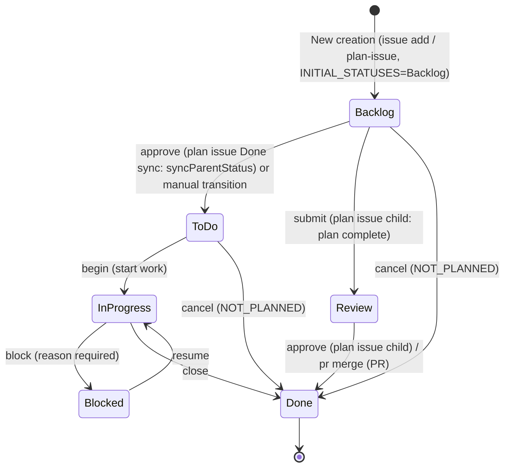

# Project Items Rule

## Required Fields

Every project item MUST have:

| Field | Required | Options |
|-------|----------|---------|
| Status | Yes | See workflow below |
| Priority | Yes | Critical / High / Medium / Low |
| Size | Recommended | XS / S / M / L / XL |
| Type | Yes | Organization Issue Types (manual setup) |

## Status Workflow (6-Value Model, ADR-v3-022 Second Revision)



| Status | Description |
|--------|-------------|
| Backlog | Uninvestigated / untriaged. Initial value for Issue / Plan Issue creation (`INITIAL_STATUSES = ["Backlog"]`) |
| ToDo | Plan approved, ready to start. Auto-transitioned by `syncParentStatus` after plan issue `approve` (Review → Done) |
| In progress | Currently working on (planning, design, or implementation) |
| Blocked | Blocked by external dependency or pending confirmation. `block --reason` transitions here; reason is recorded as a comment |
| Review | Human review pending (plan issue child plan review, or PR code review only) |
| Done | Completed / closed (cancelled issues also use Done with `state_reason: not_planned`) |

> Legacy statuses (`Approved` / `Completed` / `Pending` / `Ready` / `On Hold` / `Cancelled`, etc.) are deprecated by ADR-v3-018. Legacy values are read transparently via `LEGACY_STATUS_VALUES`. `Backlog` is restored as an active Status in ADR-v3-022 Second Revision.

### status approve and Done Transition (ADR-v3-022 Second Revision)

`approve {number}` is a checkpoint command to approve a Review-status Issue (ADR-v3-022 Second Revision).

- **Plan Issue (issue itemType)**: Review → **Done** (plan complete). `syncParentStatus` auto-syncs parent Issue from Backlog → ToDo
- **Fails if not Review**: exits with `result: "error"` and exit 1
- **JSON output**: `{ "result": "ok" | "error", "to": "Done", "next_suggestions": [...] }`

**Approval model (ADR-v3-022 Second Revision)**: `approve` transitions Review → Done. The legacy `Review → ToDo` path is abolished. After plan issue (child) `approve`, `syncParentStatus` automatically syncs the parent Issue from Backlog → ToDo (ready to start).

### 4-System Transition Tables (ADR-v3-022)

ADR-v3-022 manages forward and rollback transitions in 4 separate tables for Issue and PR.

#### ISSUE_FORWARD_TRANSITIONS

| From | To | Command |
|------|----|---------|
| `Backlog` | `ToDo` | `approve` (plan issue Done sync: syncParentStatus) or manual transition |
| `Backlog` | `Review` | `submit` (plan issue child only) |
| `Backlog` | `Done` | `cancel` |
| `ToDo` | `In progress` | `begin` |
| `ToDo` | `Done` | `cancel` |
| `In progress` | `Blocked` | `block` |
| `In progress` | `Done` | `close` |
| `Blocked` | `In progress` | `resume` |
| `Review` | `Done` | `approve` (plan issue child) / `pr merge` (PR) |

#### ISSUE_ROLLBACK_TRANSITIONS

`--rollback` flag is required.

| From | To | Purpose |
|------|----|---------|
| `In progress` | `Backlog` | Re-plan from scratch |
| `Blocked` | `Backlog` | Abandon and re-investigate |
| `Review` | `Backlog` | Plan issue review rejected (re-draft) |
| `Done` | `In progress` | Reopen (continue implementation) |
| `Done` | `ToDo` | Reopen (back to ready state) |
| `Done` | `Backlog` | Reopen (re-investigation needed) |

#### PR_FORWARD_TRANSITIONS

| From | To | Command |
|------|----|---------|
| `In progress` | `Review` | `pr create` / `submit` |
| `Review` | `Done` | `pr merge` |

#### PR_ROLLBACK_TRANSITIONS

`--rollback` flag is required.

| From | To | Purpose |
|------|----|---------|
| `Review` | `In progress` | PR code review rejected |

> **`Backlog → In progress` direct transition does not exist**: Always requires the two-step path `Backlog → ToDo → In progress`.
>
> **Rollback transitions require `--rollback`**: Use `status transition --to {rollback-target} --rollback`. Rollback transitions without `--rollback` are rejected.

### PR Status Workflow

PRs use the same Status field as Issues, operating on a subset of the Issue workflow. Detailed review state is managed by GitHub's native PR `review_decision` (APPROVED / CHANGES_REQUESTED / REVIEW_REQUIRED).

| Status | Description | Transition Trigger |
|--------|-------------|-------------------|
| In progress | Immediately after PR creation | Auto-set by `pr create` when adding PR to Projects |
| Review | Code review pending | `submit N` (In progress → Review) |
| Done | After merge | Auto-set by `pr merge` |

**PRs do not go through ToDo**: PR approval means merge authorization, and `pr merge` transitions Review → Done directly.

> `integrity` detects PR status inconsistencies (OPEN PR with Done status, MERGED/CLOSED PR with active status).

### Two-Layer Status Model (Epics / Sub-Issues)

Epic Issue status is **auto-derived** from sub-issue states. Manual updates are generally unnecessary.

| Sub-Issue State | Effect on Parent Issue |
|----------------|----------------------|
| All sub-issues Done | Parent auto-transitions to Done |
| Some In progress / Review | Parent stays In progress |
| Some Done + rest ToDo | Parent stays In progress (treated as in-progress) |
| All sub-issues Done + cancel | Parent auto-transitions to Done |

**Cascading Close on parent close**: When a parent Issue is closed, all OPEN child Issues are automatically transitioned to Done + Close via `syncChildCloseOnParentClose`.

**Reactive auto-derivation**: The CLI detects sub-issue status changes during `status transition`, `issue close` (including `issue cancel`), `status update-batch`, and `pr merge`, then auto-derives and updates the parent status.

### Plan Reset Flow

To reset an epic's plan from scratch (when sub-issues already exist):

1. Set all sub-issues to Done(NOT_PLANNED) via `issue cancel {sub-numbers}`
2. Re-plan with `prepare-flow`

### Idea → Issue Flow

Ideas and proposals start as **Discussions** (Research or Knowledge category), not Issues.

| Stage | Location | When to Move |
|-------|----------|--------------|
| Idea / exploration | Discussion | When the idea is first raised |
| Decided to do | Issue (Backlog) | When the team agrees to implement |
| Requirements firm | Issue (Review) | After plan drafting completes in plan issue |

## Size Estimation

| Size | Time | Example |
|------|------|---------|
| XS | ~1h | Typo fix, config change |
| S | ~4h | Small feature, bug fix |
| M | ~1d | Medium feature |
| L | ~3d | Large feature |
| XL | 3d+ | Epic (should be split) |

## Body Template

```markdown
## Purpose
{who} can {what}. {why}.

## Summary
{What this item does}

## Background
{Current problems, relevant constraints and dependencies}

## Considerations
- {Perspectives and constraints for the planning phase}

## Deliverable
{What "done" looks like}
```

> For type-specific templates (bug reproduction steps, research investigation items, etc.), see the `create-item` reference.

## Status Update Triggers

AI MUST update issue status at these points:

| Trigger | Action | Owner | Command |
|---------|--------|-------|---------|
| Planning started | → In progress + assign | `prepare-flow` | `begin {n}` |
| Plan created | → Review | `prepare-flow` | `submit {n}` (plan issue child: Backlog → Review) |
| Design started | → In progress + assign | `design-flow` | `begin {n}` |
| Design complete | → Review | `design-flow` | `submit {n}` (design issue child: Backlog → Review) |
| User approves Issue | Review → **Done** (plan issue child). Parent Issue auto-synced Backlog → ToDo via syncParentStatus | `approve` skill / manual | `approve {n}` |
| User starts work | ToDo → In progress + assign + branch | `implement-flow` | `begin {n}` |
| implement-flow chain complete | PR → Review | `implement-flow` | `submit {n}` (after PR creation, simplify, security-review, lint docs, work summary) |
| review-flow starts | → In progress + assign | `review-flow` | `begin {n}` |
| review-flow response complete | → Review | `review-flow` | `submit {n}` |
| PR merged | → Done | `commit-issue` (via `pr merge`) | Automatic |
| Blocked by dependency | → Blocked | Manual | `block {n} --reason "reason"` (reason auto-recorded as comment) |
| Unblock | → In progress | Manual | `resume {n}` or `resume {n} --comment FILE` |
| Complete (no PR needed) | → Done | Manual | `status update-batch --done {n}` |
| Cancelled | → Done(NOT_PLANNED) | `issue cancel` | `cancel {n}` |

> **GitHub Projects built-in automation**: When the `Pull request linked to issue` workflow is enabled, linking a PR to an Issue automatically adds both to the Project. Date fields (Start at / Review at / End at) on the PR are set automatically by `integrity`. See the "GitHub Projects Workflow Configuration" section in `github-commands.md` for setup instructions.

### In Progress Usage (Planning and Implementation)

- **Purpose**: Visibility that active work is in progress (planning, design, or implementation)
- **Entry**: `prepare-flow` sets this status when planning starts; `design-flow` sets when design starts; `implement-flow` sets when implementation begins
- **Exit**: Work complete → Review

### Review Usage (AI Work Complete, User Review Possible)

Review means "AI work is complete and the user (human) can review". Per **ADR-v3-022 D-1**: a parent (task) issue's Review is **exclusively for PR review**. Plan reviews use the plan issue (child) Review state. An entity enters Review **exactly once** during its lifecycle (1 entity = 1 Review principle).

#### **DO NOT**: Cases where transitioning to Review is forbidden

**Do NOT call `submit` if any of the following applies:**

- The issue / plan issue has already passed through Review once (re-transitioning is forbidden — one Review per entity)
- The most recent work was responding to review feedback and more feedback is expected (intermediate cycle)
- You merely want to ask the user a question or pause for a checkpoint
- Partial completion (PR created only, tests not run, simplify not done, lint docs not done, etc.)
- AI self-checking activity (do NOT use the word "Review" for AI's own checking — stay in `In progress`)
- Currently handling reviewer feedback in `review-flow` (PR review response stays in In progress and completes within the PR thread)

> Do not be misled by the broader sense of "Review" common in LLM training data ("self-review", "intermediate checkpoint"). In this project, Review means **only "the human's turn to judge"**.

#### How an entity enters Review (once per entity)

| Entity | Trigger to enter Review | Exit from Review |
|---|---|---|
| Issue | — (ADR-v3-022: Issue Review is for PR review only; create-item-flow does not transition to Review) | — |
| Plan Issue | After plan drafting + AI self-review in `prepare-flow` (**creation only**) | `approve` → Done (plan complete). Parent Issue auto-synced Backlog → ToDo |
| Design Issue (child) | After design drafting + AI self-review in `design-flow` (**creation only**) | `approve` → Done (design complete). Parent Issue auto-synced Backlog → ToDo via syncParentStatus (ADR-v3-022 D-1 / `design-flow` Phase 5) |
| PR | At `pr create` (code review possible) | `pr merge` → Done |

#### Issues / Plan Issues do NOT re-transition to Review during implementation

Per ADR-v3-022 D-1, while a PR is active during implementation, the issue and plan issue **stay in In progress untouched**. Code review is **carried by the PR itself in Status: Review** (parent issue Review is reserved for PR review only).

Therefore `implement-flow` / `review-flow` MUST NOT `submit` the issue or plan issue at the chain tail (only `pr create` transitions the PR to Review).

### Rules

1. **One In progress at a time** - Move previous item out before starting new one (exception: batch mode, epics)
2. **Branch per issue** - Create a feature branch when starting work (exception: batch, epics)
3. **Event-driven**: Status changes happen immediately when events occur
4. **block requires reason** - Add a comment explaining the blocker
5. **Idempotency** - If status is already correct, skip the update (no error)

### CLI and GitHub Projects Workflows Responsibility Division

GitHub Projects has built-in Workflows (e.g., `Item closed` → set Status to Done), and the CLI's `issue close` also sets Status to Done. This can result in the same Status update being executed twice.

| Operation | CLI Responsibility | Workflows Responsibility | Duplicate Execution |
|-----------|-------------------|--------------------------|---------------------|
| Issue close | `issue close` sets Status → Done | `Item closed` sets Status → Done | Yes (idempotent) |
| PR merge | `pr merge` sets Status → Done | `Pull request merged` sets Status → Done | Yes (idempotent) |
| Issue reopen | `issue reopen` restores Status | `Item reopened` sets Status → ToDo | Potential conflict |

**Principles:**
- CLI performs **authoritative Status updates** (including timestamp updates and parent issue derivation)
- Workflows act as a **backstop** (covering manual operations that bypass the CLI)
- Duplicate execution is harmless due to idempotency
- On reopen, CLI's Status restore and Workflows' ToDo setting may conflict; Workflows may overwrite after CLI execution. If conflicted, correct with `shirokuma-flow status update-batch {number} --status {correct-status}`

## Initial Status at Issue Creation

When creating an Issue with `issue add`, the initial Status defaults to **Backlog** (uninvestigated / untriaged) per ADR-v3-022 Second Revision.

**Plan Issue creation procedure:**

```bash
# 1. Create with Backlog (default)
shirokuma-flow issue add /tmp/shirokuma-flow/{n}-plan-issue.md
# 2. submit transitions Backlog → Review (plan complete)
shirokuma-flow submit {PLAN_ISSUE_NUMBER}
```

## Plan Issue Approach

Plans are created as child issues of the parent issue (issues with titles starting with "Plan:" or "計画:"). This allows plans to be managed as independent issues, making phase progress visible on GitHub Projects.

### Plan Issue Structure

- **Title**: `Plan: {parent issue title}`
- **Status**: `Backlog` (right after creation) → `Review` (after plan review completes, via `submit`) → `Done` (after approval)
- **Labels**: `area:plan`
- **Body**: Full plan content (approach, target files, task breakdown, risks, etc.)

### Plan Issue Status Transitions

Plan issues represent the lifecycle of the plan itself and do not participate in work progress tracking.

| Status | Description | Transition Trigger |
|--------|-------------|-------------------|
| Backlog | Planning in progress (right after creation) | `prepare-flow` creates plan issue (`INITIAL_STATUSES = ["Backlog"]`) |
| Review | Plan created, awaiting review | `prepare-flow` sets after plan review passes (`submit N`, Backlog → Review) |
| Done | Plan approved | `approve {plan-number}` (Review → Done). Parent Issue auto-synced Backlog → ToDo via syncParentStatus |

**`integrity` aggregation exclusion**: When auto-deriving parent Issue status, plan issues with the `area:plan` label are excluded from sub-issue status aggregation. This prevents a plan issue remaining in Review from affecting the parent's In progress derivation.

### Plan Issue-Centric Status Model (ADR-v3-017 + ADR-v3-022)

**Core principle**: The plan issue is the primary subject of status transitions. The parent (task) issue status is auto-derived by `syncParentStatus` from child issue statuses. AI sessions and CLI commands should target **the plan issue**.

#### Lifecycle and Target Issues

| Phase | Target Issue | Status | Trigger |
|-------|-------------|--------|---------|
| Planning | Plan Issue | Backlog | `prepare-flow` creates plan issue (`INITIAL_STATUSES = ["Backlog"]`) |
| Plan review | Plan Issue | Review | `prepare-flow` executes `submit {plan-number}` (Backlog → Review) |
| Plan approved | Plan Issue | Done | `approve {plan-number}` (Review → Done). Parent Issue auto-synced Backlog → ToDo via syncParentStatus |
| Issue closed | Plan Issue | Done + Closed | Parent Issue close triggers `syncChildCloseOnParentClose` |

**Parent issue status is auto-derived**: After plan issue transitions to Done, `syncParentStatus` aggregates child issue statuses to derive and update the parent's expected status.

#### `pr create` / `pr merge` Plan Issue Redirect

| Command | When linked issue has plan issue | When no plan issue |
|---------|----------------------------------|---------------------------------------|
| `pr create` | Transition plan issue to Review (identify plan issue from `Closes #N`) | Directly transition linked issue to Review |
| `pr merge` | Transition plan issue to Done (parent auto-derived by `syncParentStatus`) | Directly transition linked issue to Done |

#### `integrity` Inconsistency Detection Patterns (ADR-v3-017)

| Pattern | Severity | Situation | `--fix` Action |
|---------|---------|-----------|----------------|
| P1 | error | Plan issue is Backlog/ToDo/Approved (LEGACY) but parent is In progress/Review | Transition plan issue to In progress |
| P2a | warning | Plan issue is In progress but parent is Review | Re-derive parent via `syncParentStatus` |
| P3 | error | Plan issue is OPEN but parent is Done/CLOSED | Transition plan issue to Done + Close |

### Referencing a Plan Issue

Identify the child issue with a title starting with "Plan:" from `subIssuesSummary`, then fetch its body via `issue context {plan-issue-number}`.

```bash
shirokuma-flow issue context {parent-number}
# → Identify child issue with title starting with "Plan:" from subIssuesSummary
shirokuma-flow issue context {plan-issue-number}
# → Read .shirokuma/github/{org}/{repo}/issues/{plan-issue-number}/body.md
```

> **Backward compatibility**: When no plan issue exists but the Issue body contains a `## Plan` section (legacy approach), use it as a fallback.

## Plan-Implementation Deviation: Issue Body Update

The Issue body is the reviewer's primary source of truth. When implementation deviates from the plan, update the Issue body to reflect reality.

### When Update Is Needed

| Criteria | Update needed | No update needed |
|----------|--------------|-----------------|
| File structure | Added/removed files not in the plan | Modified only planned files |
| Approach | Adopted a different implementation approach | Implemented as planned |
| Scope | Added/removed/split tasks | Completed planned tasks as-is |

### What to Update

1. **Task checklist**: Update `- [ ]` to `- [x]` in `## Plan` / `### Task Breakdown` for completed items
2. **Plan change annotation**: Add strikethrough and change reason at modified sections

```markdown
### Approach

~~Summarize and consolidate into flat files~~
→ Copy into subdirectories (changed during implementation: to avoid knowledge loss risk)
```

### Timing

Not automated as part of the chain. AI judges and executes at these points:

- When a direction change is confirmed during implementation
- During self-review after PR creation
- When a reviewer points out the discrepancy

Follow the comment-first principle: record the deviation reason as a comment before updating the body. The comment must be a primary record containing rationale, alternatives considered, and "why" — not just "what changed".

### Command

```bash
shirokuma-flow issue update {number} /tmp/shirokuma-flow/{number}-body.md
```

Epic status management, built-in automations, label details, item body maintenance, and item creation guidelines are auto-loaded when the `managing-github-items` skill is executed.

## Comment Retrieval Convention When Reviewing Issues/PRs/Discussions

### `issue context` vs Direct Subcommand Usage

| Command | Returns | Use case |
|---------|---------|----------|
| `shirokuma-flow issue context {number}` | Body + all comments (cached) | Content review, pre-implementation research |
| `shirokuma-flow issue show {number}` | Body only | Checking field values (Status/Priority, etc.) |
| `shirokuma-flow pr show {number}` | Body only | PR metadata (branches, change counts, etc.) |
| `shirokuma-flow discussion show {number}` | Body only | Discussion body only |

### Workflow That Assumes Full Comment Loading

When AI reviews the content of an Issue/PR/Discussion, **use `shirokuma-flow issue context {number}` to cache comments, then read `.shirokuma/github/{org}/{repo}/issues/{number}/body.md` with the Read tool**. This gives you:

- Issue: body + all comments (plan details, discussion history, blocker information)
- PR: body + review comments + review threads + regular comments
- Discussion: body + all comments + replies (thread structure)

### Comment Writing Convention

| Purpose | Include in comment |
|---------|-------------------|
| Plan decision rationale | Reasoning for selected approach, alternatives considered, constraints discovered (posted as comment on plan issue) |
| Direction change during implementation | Reason for change, alternatives considered, "why" as primary record |
| Blocker notification | Blocker description, scope of impact, resolution conditions |
| Response to review feedback | What was changed, where, and remaining issues |

Comments must contain "why" as a primary record. Avoid comments that only describe "what was done".

### When to Update the Body

Update the body when comments reflect a state that diverges from the Issue/PR's current description. Follow the **comment-first principle**: record in a comment first, then update the body.

| Update needed | No update needed |
|--------------|-----------------|
| Adopted a different approach than planned | Completed implementation as planned |
| Scope (tasks or files) changed | Only implementation details changed |
| Definition of "done" changed | Bug fix or minor adjustment only |
