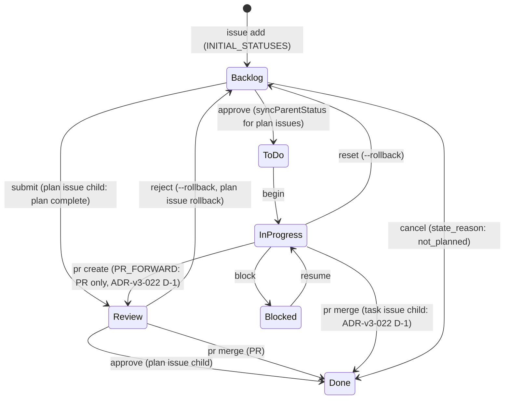

# GitHub Operations Reference

Shared reference for all session/GitHub skills. Single source of truth for CLI commands, workflows, and conventions.

## Contents

- Architecture: Issues + Projects Hybrid
- Prerequisites
- DraftIssue vs Issue
- shirokuma-flow CLI Reference
- `--from-file` vs `--body-file` Usage Guide
- Status Workflow
- Labels Convention
- Common Error Handling

## Architecture: Issues + Projects Hybrid

| Component | Purpose |
|-----------|---------|
| **Issues** | Task management, `#123` references, history |
| **Projects** | Status/Priority/Size field management |
| **Labels** | Supplementary area classification (`area:cli`, `area:plugin`, etc.) |
| **Discussions** | ADR, Knowledge, Research, Q&A |

**Status is managed via Projects fields** (not Labels).

Project naming convention: Project name = repository name (e.g., `blogcms` repo → `blogcms` project).

## Prerequisites

- `gh` CLI installed and authenticated
- GitHub Project configured (run `/setting-up-project` if not)
- Discussions enabled with categories: ADR, Knowledge, Research (optional)

## DraftIssue vs Issue

| Feature | DraftIssue | Issue |
|---------|-----------|-------|
| `#number` | No | Yes (`#123`) |
| External reference | No | Yes |
| Comments | No | Yes |
| Use case | Lightweight memo | Full task |

**Recommendation**: Use `issue add` by default for `#number` support.

## shirokuma-flow CLI Reference

Prefer shirokuma-flow CLI over direct `gh` commands. Config in `.shirokuma/config.yaml`.

### Issues (Primary Interface)

```bash
shirokuma-flow issue list                            # Open issues
shirokuma-flow issue list --all                      # Include closed
shirokuma-flow issue list --status "In progress"     # Filter by status
shirokuma-flow issue context {number}                # Fetch details and cache (→ Read .shirokuma/github/{org}/{repo}/issues/{number}/body.md)
shirokuma-flow issue add /tmp/shirokuma-flow/new-issue.md  # Metadata + body in one file
shirokuma-flow issue update {number} /tmp/shirokuma-flow/{number}-body.md  # Update body
shirokuma-flow issue update {number} --title "New title"                           # Update title
shirokuma-flow issue update {number} --labels "area:cli,area:plugin"               # Update labels
shirokuma-flow issue update {number} --assignees "@me"                             # Update assignees
shirokuma-flow begin {number}                                                       # In progress + assign @me (checkpoint, recommended)
shirokuma-flow submit {number} [--comment <file>]                                   # Move to Review (checkpoint, recommended)
shirokuma-flow block {number} --reason "..."                                        # Move to Blocked + record reason (checkpoint, recommended)
shirokuma-flow resume {number} [--comment <file>]                                   # Blocked → In progress (checkpoint, recommended)
shirokuma-flow approve {number}                                                     # Review → Done (for plan issues, syncParentStatus auto-syncs parent Backlog → ToDo) (checkpoint, recommended; ADR-v3-022)
shirokuma-flow status transition {number} --to "In progress"                        # primitive status transition (use for non-checkpoint targets such as ToDo)
shirokuma-flow issue comment {number} /tmp/shirokuma-flow/{number}-comment.md
shirokuma-flow issue comments {number}                   # List comments
shirokuma-flow issue update {number} --comment {comment-id} /tmp/shirokuma-flow/{number}-comment-fix.md  # Edit comment
shirokuma-flow issue close {number}
shirokuma-flow issue cancel {number}
shirokuma-flow issue reopen {number}
```

### Pull Requests

```bash
shirokuma-flow pr create --from-file /tmp/shirokuma-flow/pr.md             # Metadata + body in one file
shirokuma-flow pr create --base main --head develop --title "release: v0.2.0"  # Release workflow (metadata only)
shirokuma-flow pr list                                      # PR list (default: open)
shirokuma-flow pr list --state merged --limit 5            # Filtering
shirokuma-flow pr show {number}                             # PR details (body, diff stats, linked issues)
shirokuma-flow pr comments {number}                         # Review comments and threads
shirokuma-flow pr merge {number} --squash                   # Merge + status update
shirokuma-flow pr reply {number} --reply-to {id} - <<'EOF'
Reply content
EOF
shirokuma-flow pr resolve {number} --thread-id {id}        # Resolve thread
```

### Projects (Item Operations)

```bash
shirokuma-flow project update {number} --field-status "Done"  # Field update (only way)
shirokuma-flow project add-issue {number}                     # Add issue to project
shirokuma-flow project delete PVTI_xxx                        # Delete item
```

### Discussions

```bash
shirokuma-flow discussion list --category ADR --limit 5
shirokuma-flow discussion search "keyword"            # Discussion search
shirokuma-flow issue search --type discussions "keyword"     # Via issue search
shirokuma-flow issue context {number}   # Fetch details and cache (→ Read .shirokuma/github/{org}/{repo}/issues/{number}/body.md)
shirokuma-flow discussion add /tmp/shirokuma-flow/discussion.md  # Metadata + body in one file
```

### Cross-search

```bash
shirokuma-flow issue search "keyword"                          # Issues / PR search (default)
shirokuma-flow issue search --type discussions "keyword"       # Discussions only
shirokuma-flow issue search --type issues,discussions "keyword" # Issues + Discussions cross-search
```

### Repository

```bash
shirokuma-flow repo info
shirokuma-flow repo labels
```

### Cross-repo Operations

```bash
shirokuma-flow issue list --repo docs
shirokuma-flow issue add --repo docs /tmp/shirokuma-flow/new-issue.md
```

### gh Fallback (CLI unsupported only)

```bash
# Label management
gh label list
gh label create "name" --color "0E8A16" --description "Desc"

# Repository info
gh repo view --json nameWithOwner -q '.nameWithOwner'

# Authentication
gh auth login
gh auth status

```

## `--from-file` vs `--body-file` Usage Guide

| Pattern | Commands | Reason |
|---------|----------|--------|
| `issue add` recommended | `issue add`, `discussion add` | Metadata + body in one file, prevents flag combination errors |
| `--body-file` kept | `pr reply`, `status update-batch` | Body only, no metadata needed |
| `issue update` / `status transition` | Status/body/title/labels/assignees update | Direct update without cache-edit workflow (`status transition` is the primitive; prefer `begin`/`submit`/`block`/`resume`/`approve` for normal use) |

### `--from-file` Frontmatter Format

```markdown
---
title: Issue Title
type: Feature
priority: Medium
size: M
labels: [area:cli]
---

Body content goes here.
```

Safe frontmatter fields vary by command:

| Command | Safe Fields |
|---------|-------------|
| `issue add` | `title`, `type`, `priority`, `size`, `labels`, `state`, `state_reason`, `parent` |
| `pr create` | `title`, `base`, `head` |
| `discussion add` | `title`, `category` |

CLI flags take precedence when set. `--from-file` and positional `[body-file]` are mutually exclusive (error if both specified).

### Body Passing Tier Guide

`issue add` / `issue comment` / `pr create` / `pr edit` / `pr reply` accept only positional file arguments (inline strings are structurally rejected). `issue close` / `issue cancel` / `pr close` / `discussions create` etc. still take `--body-file`. The Tier selection logic is identical:

| Tier | Target | Pattern | Usage |
|------|--------|---------|-------|
| Tier 1 (stdin) | residual `--body-file` commands | `--body-file - <<'EOF'...EOF` | Close reasons (issue close / cancel, pr close), short notes |
| Tier 1 (stdin) | positional commands | `pr reply 42 --reply-to N - <<'EOF'...EOF` | Short replies |
| Tier 2 (file) | residual `--body-file` commands | Write → `--body-file /tmp/shirokuma-flow/xxx.md` | Discussion posts, Project bodies |
| Tier 2 (file) | positional commands | Write → `issue add /tmp/shirokuma-flow/xxx.md` etc. | Issue bodies, PR bodies, comments |

Use `<<'EOF'` as heredoc delimiter (single quotes prevent variable expansion). When iteratively updating bodies via Tier 2, apply the Write/Edit pattern (initial Write → subsequent Edit for diff-only updates). See the "File-Based Body Editing" section in `item-maintenance.md` for details.

## Status Workflow

GitHub Projects V2 Status has 6 values (ADR-v3-022):



| Status | Description | Primary command |
|--------|-------------|-----------------|
| Backlog | Newly created / not started. Default when issue is added | `issue add` initial value |
| ToDo | Ready to start (auto-transitioned via syncParentStatus after plan approval) | Auto-sync after `approve` (plan issue child) / `status transition --to ToDo` (manual) |
| In progress | Working (planning / design / implementation) | `begin <N>` |
| Blocked | Blocked (reason recorded in issue comment) | `block <N> --reason "..."` |
| Review | Awaiting review (plan review / code review). ADR-v3-022 D-1 constraint: parent issue Review is exclusively for PR review (plan issue child is a separate entity) | `submit <N>` |
| Done | Closed / cancelled (cancellations use Done with state_reason: not_planned) | `approve <N>` / `issue cancel <N>` |

Legacy statuses (`Approved` / `Completed` / `Pending` / `Ready` / `On Hold` / `Cancelled`, etc.) are deprecated. Legacy values are read transparently via `LEGACY_STATUS_VALUES`.

## Labels Convention

Work type classification is primarily handled by **Issue Types** (Organization-level Type field). Labels indicate the **affected area** as a supplementary mechanism:

| Mechanism | Role | Example |
|-----------|------|---------|
| Issue Types | **What** kind of work | Feature, Bug, Chore, Docs, Research, Evolution |
| Area labels | **Where** the work applies | `area:cli`, `area:plugin` |
| Operational labels | Triage / lifecycle | `duplicate`, `invalid`, `wontfix` |

Labels are added manually based on project structure. Status is managed via Projects fields.

## Common Error Handling

| Error | Action |
|-------|--------|
| `shirokuma-flow: command not found` | Install: `npm i -g @shirokuma-library/flow` |
| `gh: command not found` | Install: `brew install gh` or `sudo apt install gh` |
| `not logged in` / `not authenticated` | Run: `gh auth login` |
| No project found | Run `/setting-up-project` to create one |
| Discussions disabled/category not found | Use local file fallback |
| `HTTP 404` | Check repository name and permissions |
| API rate limit | Show cached/partial data |
