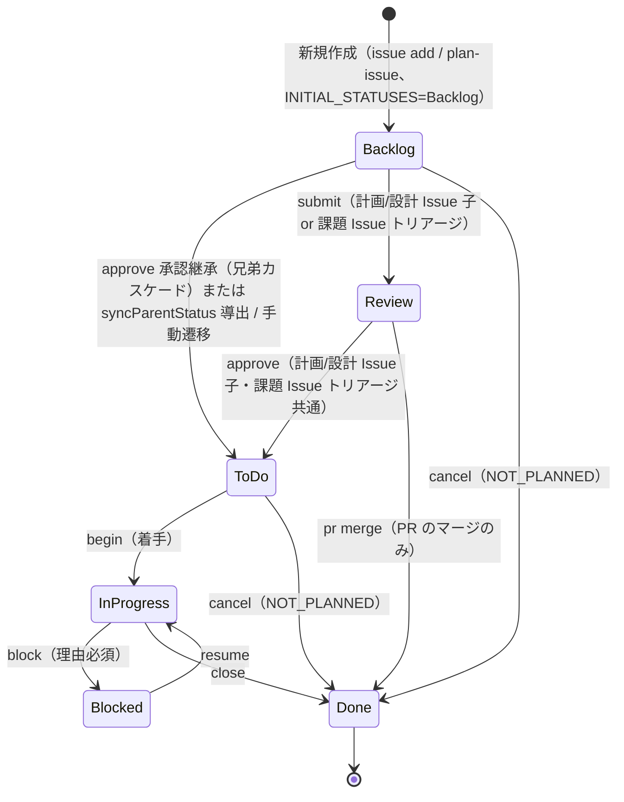

# プロジェクトアイテムルール

## 必須フィールド

| フィールド | 必須 | オプション |
|-----------|------|-----------|
| Status | はい | 下記ワークフロー参照 |
| Priority | はい | Critical / High / Medium / Low |
| Size | 推奨 | XS / S / M / L / XL |
| Type | はい | Organization Issue Types で管理（手動セットアップ） |

## ステータスワークフロー（6 値モデル）



| ステータス | 説明 |
|-----------|------|
| Backlog | 未調査・未トリアージ。Issue / 計画 Issue 作成時の初期値（`INITIAL_STATUSES = ["Backlog"]`） |
| ToDo | 計画承認済み・着手準備完了。計画 Issue の `approve`（Review → ToDo）後、承認継承（兄弟カスケード）で実装サブ Issue が Backlog → ToDo に遷移し、親 Issue は `syncParentStatus` が子から導出する |
| In progress | 作業中（計画策定・設計・実装すべて含む） |
| Blocked | 外部依存待ち・確認待ち等でブロック中。`block --reason` で遷移し、理由がコメントに記録される |
| Review | 人間レビュー待ち（計画 Issue 子の計画レビュー、または PR のコードレビューのみ） |
| Done | 完了・クローズ済み（キャンセルも `state_reason: not_planned` で Done に統一） |

> 旧 Status（`Approved` / `Completed` / `Pending` / `Ready` / `On Hold` / `Cancelled` 等）は廃止。LEGACY 値は `LEGACY_STATUS_VALUES` で透過読み取りされる。`Backlog` は現役ステータスとして復活。

### status approve の遷移（全種別 Review → ToDo）

`approve {number}` は Review 状態の Issue を承認する checkpoint コマンド。**遷移先は全種別で `Review → ToDo`** に統一され、`issue_kind` で**副作用**が分岐する（Done は計画フェーズでは設定しない）。

- **計画 Issue（子, plan 分岐）**: Review → **ToDo**。**承認継承の下方カスケード**で、同じ親（課題 Issue）配下の実装サブ Issue（計画/設計以外の子）で Backlog のものを `Backlog → ToDo` に一括遷移。親 Issue は `syncParentStatus` が子から導出
- **設計 Issue（子, design 分岐）**: Review → **ToDo**。設計 Issue は中間箱（Done にせず子から導出）。親 Issue は `syncParentStatus` が子から導出（兄弟カスケードなし）
- **課題 Issue（normal 分岐 = トリアージ承認）**: Review → **ToDo**（着手可）。親同期・カスケードなし。次フローが `begin` で着手する
- **Review 以外では失敗**: `result: "error"` で exit 1
- **JSON 出力**: `{ "result": "ok" | "error", "to": "ToDo", "issue_kind": "plan" | "design" | "normal", "pending_subissues": [...], "next_suggestions": [...] }`

**承認モデル**: `approve` は全種別で `Review → ToDo` に遷移し、計画フェーズで Issue を Done にしない。`issue_kind` で副作用が分岐する（計画 = 承認継承 + 親導出、設計 = 親導出、課題トリアージ = 副作用なし）。親 Issue は直書きせず `syncParentStatus` が子の集計から導出する（子→親の上方向のみ）。

> **`Review → Done` は PR のマージのみ**: Issue の approve では `Review → Done` は発生しない。`Review → Done` は PR のマージ承認（`pr merge`）専用である。設計 Issue は計画フェーズの中間箱であり、Done には到達しない（親 Issue の Status は子から導出される）。

### PR のステータスワークフロー

PR は Issue と同じ Status フィールドを使用し、Issue ワークフローのサブセットで運用する。レビュー状態の詳細は GitHub PR ネイティブの `review_decision`（APPROVED / CHANGES_REQUESTED / REVIEW_REQUIRED）で管理する。

| Status | 説明 | 遷移トリガー |
|--------|------|-------------|
| Backlog | PR 作成直後（AI レビュー待ち、#2802） | `pr create` が PR を Projects に追加時に自動設定 |
| Review | コードレビュー完了（AI レビュー PASS） | `review-flow` の AI レビュー PASS 後に `status transition {PR#} --to Review`（Backlog → Review）で遷移 |
| Done | マージ後 | `pr merge` で自動設定 |

**PR は Backlog で入り AI レビュー PASS で Review に上げる（#2802）**: `pr create` は PR を Backlog で作成し、`review-flow` の AI レビューが PASS した時点で `Backlog → Review` に遷移させる。FAIL / 未解決スレッドありの間は Backlog のまま保持し、修正→再レビュー PASS で初めて Review に上げる。

**PR は ToDo を経由しない**: PR の approve はマージ承認を意味し、`pr merge` で Review → Done に直行する。

> `integrity` は PR ステータスの不整合を検出する（OPEN PR が Done、MERGED/CLOSED PR がアクティブステータス）。

### 4 系統遷移テーブル

前進・ロールバックを Issue/PR 別に 4 テーブルで管理する。

#### ISSUE_FORWARD_TRANSITIONS（Issue 前進遷移）

| From | To | コマンド |
|------|----|---------|
| `Backlog` | `ToDo` | `approve` の承認継承（兄弟カスケード）/ `syncParentStatus` 導出 / 手動遷移 |
| `Backlog` | `Review` | `submit`（計画 Issue 子のみ） |
| `Backlog` | `Done` | `cancel` |
| `ToDo` | `In progress` | `begin` |
| `ToDo` | `Done` | `cancel` |
| `In progress` | `Blocked` | `block` |
| `In progress` | `Done` | `close` |
| `Blocked` | `In progress` | `resume` |
| `Review` | `ToDo` | `approve`（計画/設計 Issue 子・課題 Issue トリアージ 共通） |
| `Review` | `Done` | `pr merge`（PR のマージのみ） |

#### ISSUE_ROLLBACK_TRANSITIONS（Issue ロールバック遷移）

`--rollback` フラグ必須。

| From | To | 用途 |
|------|----|------|
| `In progress` | `Backlog` | 計画やり直し |
| `Blocked` | `Backlog` | 放棄して再調査 |
| `Review` | `Backlog` | 計画 Issue 子のレビュー差し戻し（再策定） |
| `Done` | `In progress` | 再オープン（実装継続） |
| `Done` | `ToDo` | 再オープン（着手前に戻す） |
| `Done` | `Backlog` | 再オープン（再調査が必要） |

#### PR_FORWARD_TRANSITIONS（PR 前進遷移）

| From | To | コマンド |
|------|----|---------|
| `Backlog` | `Review` | `review-flow` の AI レビュー PASS 後（`status transition {PR#} --to Review`、#2802） |
| `In progress` | `Review` | `submit`（互換・手動運用救済） |
| `Review` | `Done` | `pr merge` |

#### PR_ROLLBACK_TRANSITIONS（PR ロールバック遷移）

`--rollback` フラグ必須。

| From | To | 用途 |
|------|----|------|
| `Review` | `In progress` | PR コードレビュー差し戻し（reject） |

> **`Backlog → In progress` の直接遷移は存在しない**: 必ず `Backlog → ToDo → In progress` の 2 段階遷移が必要。
>
> **ロールバック遷移は `--rollback` 必須**: `status transition --to {ロールバック先} --rollback` を使用。`--rollback` なしのロールバック遷移は拒否される。

### 2 階層ステータスモデル（エピック / サブ Issue）

エピック Issue のステータスはサブ Issue の状態から**自動導出**される。手動更新は原則不要。

| サブ Issue の状態 | 親 Issue への影響 |
|----------------|----------------|
| 全サブ Issue が Done | 親を Done に自動遷移 |
| 一部が In progress / Review | 親を In progress に維持 |
| 一部が Done + 残りが ToDo | 親を In progress に維持（進行中とみなす） |
| 全サブ Issue が Done + cancel | 親を Done に自動遷移 |

**親 Close 時の連動 Close**: 親 Issue が Close されると、OPEN 状態の子 Issue は `syncChildCloseOnParentClose` により自動的に Done + Close される。

**リアクティブ自動導出**: CLI が `status transition`、`issue close`（`issue cancel` 含む）、`status update-batch`、`pr merge` 実行時にサブ Issue のステータス変更を検出し、親のステータスを自動的に導出・更新する。

### 計画リセットフロー

エピックの計画を白紙に戻す場合（サブ Issue が作成済みの場合）:

1. 全サブ Issue を `issue cancel {sub-numbers}` で Done(NOT_PLANNED) に変更
2. `prepare-flow` で再計画

### アイデア → Issue フロー

アイデアや提案は **Discussions**（Research または Knowledge カテゴリ）から始める。Issue ではない。

| 段階 | 場所 | 移行条件 |
|------|------|---------|
| アイデア / 探索 | Discussion | アイデアが最初に挙がったとき |
| 実装決定 | Issue (Backlog) | チームが実装に合意したとき |
| 要件確定 | Issue (Review) | 計画 Issue の計画策定完了後 |

## サイズ見積もり

| サイズ | 目安時間 | 例 |
|--------|---------|-----|
| XS | ~1時間 | タイポ修正、設定変更 |
| S | ~4時間 | 小規模機能、バグ修正 |
| M | ~1日 | 中規模機能 |
| L | ~3日 | 大規模機能 |
| XL | 3日以上 | エピック（分割すべき） |

## 本文テンプレート

```markdown
## 目的
{誰}が{何}できるようにする。{なぜ}。

## 概要
{内容}

## 背景
{現状の問題、関連する制約や依存関係}

## 検討事項
- {計画策定時に考慮すべき視点・制約}

## 成果物
{"完了" の定義}
```

> 種別ごとの詳細テンプレート（bug の再現手順、research の調査項目等）は `create-item` リファレンスを参照。

## What/Why 分離（本文 = 最新 payload / コメント = Why・履歴）

> **本節が「What/Why 分離」原則の正本（single source of truth）である。** 他のルール・スキル（`item-maintenance.md` / `project-items-details.md` / `analyze-issue` / `review-issue` / `write-adr` / `prepare-flow` / `implement-flow` / `review-flow` / `open-pr-issue`）は本節を §参照すること。定義・境界表をフル再掲しない。

GitHub アイテム（Issue / PR / Discussion / ADR）の本文とコメントは**役割が異なる**。この役割分離を「What/Why 分離」と呼ぶ。旧称「コメントファースト」は手順名であり、本原則の不変条件名へ昇格した（手順説明の文脈では従来語「コメントファースト」を併記してよい）。

関連 ADR: ADR-v3-005（知識の二層化, #1596）/ ADR-v3-026（What/Why/語彙の知識分離, #2812）/ ADR-v3-027（GitHub アイテムの What/Why 分離の再定義, #2813）。

### 不変条件

| 対象 | 役割 | 内容 |
|------|------|------|
| **本文** | What（最新 payload） | 現時点の最新かつ統合された状態。常に「今どうなっているか」を表す。過去の経緯・破棄された案を含まない |
| **コメント** | Why・履歴 | 「なぜそうしたか」の一次記録。判断根拠・検討した代替案・調査で判明した事実・経緯。追記のみで、上書きしない |

**不変条件（常に成立すべき性質）:**

1. **本文 = 最新 payload**: 本文を読めば、過去のコメントを遡らずとも現時点の最新状態が把握できる。
2. **コメント = Why・履歴**: 「なぜ」はコメントに残る。コメントを削除しても本文にない情報が失われないなら、そのコメントは実質的でない。
3. **更新順序（コメントファースト）**: 本文を更新する前に、必ず先に「なぜ」をコメントとして記録する。本文を直接更新してからコメントを後付けする逆順は禁止。

### アイテム種別 × payload 境界表

アイテム種別によって本文に書く payload の種類が異なる。

| アイテム種別 | 本文の payload | コメントの役割 |
|------------|--------------|--------------|
| Issue | **What payload**（目的・概要・現時点のタスク・成果物の最新状態） | Why・履歴（判断根拠・方針変更の理由・経緯） |
| PR | **What payload**（変更の最新の概要・テスト計画） | Why・履歴（レビュー指摘への返答・対応経緯） |
| Discussion | **What payload**（議題・現時点の合意状態） | Why・履歴（議論の経緯・反対意見） |
| ADR・知識記録型 | **Why payload**（決定の背景・根拠・帰結を本文に記録） | 補足・議論 |

**ADR 例外**: ADR は決定の「Why」自体が成果物であるため、本文に Why payload（Context / Decision / Consequences）を書く。さらに `write-adr` は **更新履歴を本文末尾の「更新履歴」セクションに記録する**（コメントではなく本文 Why payload に履歴を残す）。これは「本文 = 最新 What payload」の一般原則の**正当な例外**であり、ADR の本文が決定の歴史的記録そのものを担うことに由来する。

### 適用先

本文を書く全スキルは本原則に従う:

| スキル | 本文書き込み対象 | payload 種別 |
|-------|----------------|------------|
| `write-adr` | ADR 本文（更新履歴含む） | Why payload（**ADR 例外**） |
| `prepare-flow` | 計画 Issue 本文 | What payload |
| `implement-flow` | Issue 本文（乖離時更新） | What payload |
| `review-flow` | PR コメント・本文 | コメント = Why、本文 = What payload |
| `open-pr-issue` | PR 本文 | What payload |

## ステータス更新トリガー

AI は以下のタイミングで Issue ステータスを更新する必要がある:

| トリガー | アクション | 責任者 | コマンド |
|---------|----------|--------|---------|
| 計画策定開始 | → In progress + アサイン | `prepare-flow` | `begin {n}` |
| 計画策定完了 | → Review | `prepare-flow` | `submit {n}`（計画 Issue 子: Backlog → Review） |
| 設計開始 | → In progress + アサイン | `design-flow` | `begin {n}` |
| 設計完了 | → Review | `design-flow` | `submit {n}`（設計 Issue 子: Backlog → Review） |
| ユーザーが Issue を承認 | Review → **ToDo**（計画/設計 Issue 子・課題トリアージ 共通）。計画 approve は承認継承で実装サブ Issue を Backlog → ToDo、親 Issue は syncParentStatus で子から導出 | `approve` スキル / 手動 | `approve {n}` |
| ユーザーが着手指示 | ToDo → In progress + アサイン + ブランチ | `implement-flow` | `begin {n}` |
| implement-flow 全工程完了 | PR → Backlog で作成（#2802） | `implement-flow` | `pr create`（AI レビューは後続の review-flow が実施） |
| review-flow AI レビュー PASS | PR → Review（Backlog → Review、#2802） | `review-flow` | `status transition {PR#} --to Review`（PASS 確定時） |
| review-flow レビュー対応完了後 | PR は Review のまま（マージ待ち） | `review-flow` | — |
| マージ | → Done | `commit-issue` (via `pr merge`) | 自動更新 |
| ブロック | → Blocked | 手動 | `block {n} --reason "理由"` (reason は自動コメント化) |
| ブロック解除 | → In progress | 手動 | `resume {n}` または `resume {n} --comment FILE` |
| 完了（PR不要） | → Done | 手動 | `status update-batch --done {n}` |
| キャンセル | → Done(NOT_PLANNED) | `issue cancel` | `cancel {n}` |

> **GitHub Projects 組み込み自動化**: `Pull request linked to issue` ワークフローを有効化すると、PR が Issue にリンクされた時点で Issue と PR が自動的に Project に追加される。ワークフロー有効化手順は `github-commands.md` の「GitHub Projects ワークフロー設定」セクションを参照。

### In Progress の運用（計画・設計・実装すべてを含む）

- **目的**: アクティブな作業中であることの可視化（計画策定・設計・実装を問わず）
- **入口**: `prepare-flow` が計画開始時、`design-flow` が設計開始時、または `implement-flow` が実装開始時に設定
- **出口**: 作業完了後 → Review

### Review の運用（人間判断待ち）

Review は「AI の作業が完了し、ユーザー（人間）が判断する番が来た状態」を意味する。課題 Issue の `Review` は **2 用途**を持つ:

1. **トリアージ承認待ち**: 未トリアージ Backlog → トリアージ承認待ち Review → 承認済 ToDo（`approve` の normal 分岐で Review → ToDo）
2. **PR コードレビュー**: PR エンティティ自身が `Status: Review` を担う（実装フェーズ）

計画レビューは計画 Issue（子）の `Review` で表現し、`approve`（Review → ToDo）で承認する。承認時に同じ親配下の実装サブ Issue が Backlog → ToDo に継承される（承認継承）。

#### **DO NOT**: Review に遷移してはならないケース

**以下のいずれかに該当する場合、`submit` を呼んではならない:**

- 課題 Issue / 計画 Issue が既に一度 Review を経由している（再遷移は禁止 — 1 エンティティ 1 Review 原則）
- 直近の作業がレビュー指摘の修正対応であり、追加の指摘が想定される（中間サイクル）
- ユーザーに質問・確認したいだけの中間チェックポイント
- 部分完了（PR 作成のみ・テスト未実施・simplify 未実行・lint docs 未実行など）
- 「自己レビュー」「自分でチェック」など AI 自身の確認作業を Review と表現したくなった場合（→ 正しくは `In progress` のまま）
- レビュー対応を `review-flow` で実施中（コードレビュー対応は In progress のまま PR スレッドで完結する）

> LLM の学習データにある「Review = 自己レビュー中・中間チェックポイント」の広義に引きずられないこと。本プロジェクトでは Review = **「人間が判断する番が来た」専用** の意味で運用する。

#### Review に入る経路（各エンティティで 1 度のみ）

| エンティティ | Review に入るタイミング | Review からの遷移 |
|---|---|---|
| 課題 Issue（トリアージ） | `issue-flow` のトリアージ完了時（Backlog → Review、トリアージ承認待ち） | `approve`（normal 分岐）→ ToDo（トリアージ承認、着手可）。親同期なし |
| 計画 Issue | `prepare-flow` の計画策定 + AI 自己レビュー完了後（**作成時のみ**、Backlog → Review） | `approve` → ToDo（計画承認）。承認継承で同じ親配下の実装サブ Issue を Backlog → ToDo。親 Issue は syncParentStatus で子から導出 |
| 設計 Issue（子） | `design-flow` の設計策定 + AI 自己レビュー完了後（**作成時のみ**） | `approve` → ToDo（設計承認）。設計 Issue は中間箱（Done にしない）。親 Issue は syncParentStatus で子から導出（`design-flow` Phase 5） |
| PR | `pr create` で Backlog 作成 → `review-flow` の AI レビュー PASS で Review（Backlog → Review、#2802） | `pr merge` → Done |

#### 実装フェーズの課題 Issue / 計画 Issue は Review に再遷移しない

実装フェーズで PR が動く間、課題 Issue・計画 Issue は **In progress のまま触らない**。コードレビューは **PR 自身が Status: Review を担う**。

そのため `implement-flow` / `review-flow` のチェーン末尾で課題 Issue / 計画 Issue を `submit` してはならない。PR 自身は `pr create` で Backlog で作成され、`review-flow` の AI レビュー PASS 後に `Backlog → Review` に遷移する（#2802）。

### 次フロー共通ゲート（prepare / design / implement の正本）

課題 Issue のステータス別「着手挙動」を、`prepare-flow` / `design-flow` / `implement-flow` の 3 フローで統一する。**本節がこの 3 フローの正本**であり、各フローの SKILL.md は本節を参照して同一文言・同一遷移の要約表のみを置く（DRY）。

| 課題 Issue の現在ステータス | 次フロー共通ゲートの挙動 |
|---------------------------|----------------|
| `Backlog`（未トリアージ） | 着手 NG。トリアージ未完了のため `Review`（トリアージ承認待ち）へ進めるよう案内して停止 |
| `Review`（トリアージ承認待ち） | AskUserQuestion で承認確認 → 承認なら `approve`（normal 分岐）で `Review → ToDo` → `begin` で In progress |
| `ToDo`（承認済み） | そのまま `begin` で In progress |
| `In progress` | スキップ（継続） |

> **計画 Issue 子の Review との区別**: 上表は**課題 Issue（親）**のステータスに対する共通ゲート。`prepare-flow` は加えて**計画 Issue（子）**の Review（＝再計画確認、`approve` で Review → ToDo）を区別して扱う。詳細は `prepare-flow` スキルのステップ 1b を参照。

### ルール

1. **同時に In progress は1つ** — 新しい作業を始める前に前のアイテムを移動する（例外: バッチモード、エピック）
2. **Issue ごとにブランチ** — 作業開始時にフィーチャーブランチを作成（例外: バッチ・エピック）
3. **イベント駆動**: Status 変更はイベント発生時に即座に実行する
4. **block は理由必須** — ブロッカーを説明するコメントを追加
5. **冪等性**: 既に正しい Status なら更新をスキップ（エラーにしない）

### CLI と GitHub Projects Workflows の責務分担

GitHub Projects には組み込みの Workflows（`Item closed` → Status を Done に設定等）があり、CLI の `issue close` も Status を Done に設定する。これにより同じ Status 更新が二重に実行される場合がある。

| 操作 | CLI の責務 | Workflows の責務 | 二重実行 |
|------|-----------|-----------------|---------|
| Issue クローズ | `issue close` が Status → Done | `Item closed` が Status → Done | あり（冪等） |
| PR マージ | `pr merge` が Status → Done | `Pull request merged` が Status → Done | あり（冪等） |
| Issue リオープン | `issue reopen` が Status 復元 | `Item reopened` が Status → ToDo | 競合の可能性あり |

**原則:**
- CLI が**権威ある Status 更新**を行う（親 Issue 導出を含む）
- Workflows は**バックストップ**として機能する（CLI を経由しない手動操作をカバー）
- 二重実行は冪等性により実害なし
- リオープン時のみ CLI の Status 復元と Workflows の ToDo 設定が競合し得るが、CLI 実行後に Workflows が上書きする可能性がある。競合した場合は `shirokuma-flow status update-batch {number} --status {正しいステータス}` で修正する

## Issue 作成時の初期ステータス

`issue add` コマンドで Issue を作成する際、初期 Status は **Backlog**（未調査・未トリアージ）がデフォルト（`INITIAL_STATUSES = ["Backlog"]`）。

**計画 Issue の作成手順:**

```bash
# 1. Backlog で作成（初期値）
shirokuma-flow issue add /tmp/shirokuma-flow/{n}-plan-issue.md
# 2. submit で Backlog → Review に遷移（計画策定完了）
shirokuma-flow submit {PLAN_ISSUE_NUMBER}
```

## 計画 Issue 方式

計画は親 Issue の子 Issue（タイトルが「計画:」または「Plan:」で始まる Issue）として作成される。これにより計画が独立した Issue として管理され、GitHub Projects 上でフェーズ進捗を可視化できる。

### 計画 Issue の構造

- **タイトル**: `計画: {親 Issue のタイトル}`
- **ステータス**: `Backlog`（作成直後）→ `Review`（計画策定完了後）→ `ToDo`（承認後・着手準備完了）→ `Done`（実装フェーズで PR マージ後）
- **ラベル**: （なし、タイトルプレフィックスで識別）
- **本文**: 計画の全内容（アプローチ・変更ファイル・タスク分解・リスク等）

### 計画 Issue のステータス遷移

計画 Issue は実作業の進捗には関与せず、計画自体のライフサイクルを表す。

| Status | 説明 | 遷移トリガー |
|--------|------|-------------|
| Backlog | 計画策定中（作成直後） | `prepare-flow` が計画 Issue を作成時（`INITIAL_STATUSES = ["Backlog"]`） |
| Review | 計画策定完了、レビュー待ち | `prepare-flow` が計画レビュー通過後に `submit N`（Backlog → Review） |
| ToDo | 計画承認済み・着手準備完了 | `approve {plan-number}`（Review → ToDo）。承認継承で実装サブ Issue を Backlog → ToDo、親 Issue は syncParentStatus で子から導出 |
| Done | 実装完了 | `pr merge` が `Closes #N` を解析して自動遷移 |

**`integrity` の集計除外**: 親 Issue のステータス自動導出時、タイトルが `計画:` / `Plan:` で始まる計画 Issue はサブ Issue ステータス集計から除外する。これにより、計画 Issue が Review のまま残っていても親の In progress 導出に影響しない。

### 計画 Issue 中心ステータスモデル

**基本原則**: ステータス遷移の主体は「計画 Issue」であり、課題 Issue（親 Issue）のステータスは `syncParentStatus` が子 Issue のステータスから自動導出する。AI セッション・CLI コマンドは**計画 Issue を対象**として操作すること。

#### ライフサイクルと対象 Issue

| フェーズ | 対象 Issue | ステータス | トリガー |
|---------|-----------|-----------|---------|
| 計画策定中 | 計画 Issue | Backlog | `prepare-flow` が計画 Issue を作成（`INITIAL_STATUSES = ["Backlog"]`） |
| 計画レビュー待ち | 計画 Issue | Review | `prepare-flow` が `submit {plan-number}` を実行（Backlog → Review） |
| 計画承認済み | 計画 Issue | ToDo | `approve {plan-number}`（Review → ToDo）。承認継承で実装サブ Issue を Backlog → ToDo、親 Issue は子から導出 |
| 実装中 | 計画 Issue | In progress（PR は Backlog→Review を担う） | `implement-flow` が `begin` で着手し実装・PR 作成（PR は Backlog、review-flow の AI レビュー PASS で Review、#2802） |
| 実装完了 | 計画 Issue | Done | `pr merge` が `Closes #N` を解析して自動遷移 |
| 課題クローズ | 計画 Issue | Done + Closed | 親 Issue Close 時に `syncChildCloseOnParentClose` で連動 Close |

**課題 Issue（親 Issue）のステータスは自動導出される**: 計画 Issue の各遷移後、`syncParentStatus` が子 Issue 群のステータスを集計して親の期待ステータスを導出・更新する。

#### `pr create` / `pr merge` の計画 Issue リダイレクト

| コマンド | リンク Issue に計画 Issue が存在する場合 | 計画 Issue がない場合 |
|---------|---------------------------------------|--------------------------------------|
| `pr create` | 計画 Issue を Review に遷移（`Closes #N` の N の計画 Issue を特定） | リンク Issue を直接 Review に遷移（従来通り） |
| `pr merge` | 計画 Issue を Done に遷移（親は `syncParentStatus` で自動導出） | リンク Issue を直接 Done に遷移（従来通り） |

#### `integrity` の不整合検出パターン

| パターン | Severity | 状況 | `--fix` のアクション |
|---------|---------|------|-------------------|
| P1 | error | 計画 Issue が Backlog/ToDo/Approved（LEGACY）なのに親が In progress/Review | 計画 Issue を In progress に遷移 |
| P2a | warning | 計画 Issue が In progress なのに親が Review | `syncParentStatus` で親を再導出 |
| P3 | error | 計画 Issue が OPEN のまま親が Done/CLOSED | 計画 Issue を Done + Close |

### 計画 Issue の参照

`subIssuesSummary` からタイトルが「計画:」で始まる子 Issue を特定し、`issue context {plan-issue-number}` で本文を取得する。

```bash
shirokuma-flow issue context {parent-number}
# → subIssuesSummary からタイトルが「計画:」で始まる子 Issue を特定
shirokuma-flow issue context {plan-issue-number}
# → .shirokuma/github/{org}/{repo}/issues/{plan-issue-number}/body.md を Read ツールで読み込む
```

> **後方互換**: 計画 Issue が存在せず Issue 本文に `## 計画` セクションがある場合（旧方式）は、フォールバックとして使用する。

## 計画と実装の乖離時の Issue 本文更新

Issue 本文はレビュワーにとっての一次情報源である。実装が計画から逸脱した場合、Issue 本文を実態に合わせて更新する。

### 更新が必要なケース

| 判定基準 | 更新が必要 | 更新不要 |
|---------|----------|---------|
| ファイル構成 | 計画にないファイルを追加/削除した | 計画通りのファイルを変更した |
| アプローチ | 計画と異なる実装方針を採用した | 計画通りの方針で実装した |
| スコープ | タスクを追加/削除/分割した | 計画通りのタスクを完了した |

### 更新内容

1. **タスクチェックリスト**: `## 計画` の `### タスク分解` にある `- [ ]` を完了分について `- [x]` に更新する
2. **計画変更の注記**: 変更箇所に取り消し線と変更理由を追記する

```markdown
### アプローチ

~~フラットファイルに要約・統合する~~
→ サブディレクトリにコピーする（実装時に変更: 知識欠落リスクを回避するため）
```

### タイミング

チェーンの一部として自動化しない。以下のタイミングで AI が判断して実行する:

- 実装中に方針変更が確定した時点
- PR 作成後のセルフレビュー時
- レビュワーから指摘を受けた時点

コメントファースト（[What/Why 分離](#whatwhy-分離本文--最新-payload--コメント--why履歴) の更新順序）に従い、乖離の理由をコメントとして記録してから本文を更新する。コメントは判断根拠・検討した代替案など「なぜそうしたか」を含む一次記録であること。

### コマンド

```bash
shirokuma-flow issue update {number} /tmp/shirokuma-flow/{number}-body.md
```

エピックのステータス管理・ビルトイン自動化・ラベル詳細・アイテム本文メンテナンス・アイテム作成ガイドラインの詳細は `managing-github-items` スキル実行時に自動ロードされる。

## Issue/PR/Discussion 確認時のコメント取得規約

### `issue context` vs サブコマンド直接呼び出しの使い分け

| コマンド | 返却内容 | 用途 |
|---------|---------|------|
| `shirokuma-flow issue context {number}` | 本文 + コメント全件（キャッシュ） | Issue/PR/Discussion の内容確認、レビュー、実装前調査 |
| `shirokuma-flow issue show {number}` | 本文のみ | フィールド値（Status/Priority 等）の確認のみ |
| `shirokuma-flow pr show {number}` | 本文のみ | PR メタデータ（ブランチ、変更数等）の確認のみ |
| `shirokuma-flow discussion show {number}` | 本文のみ | Discussion 本文の確認のみ |

### コメント全件読み込みを前提とするワークフロー

AI が Issue/PR/Discussion の内容を確認する場合は、**`shirokuma-flow issue context {number}` を使いコメントをキャッシュし、`.shirokuma/github/{org}/{repo}/issues/{number}/body.md` を Read ツールで読み込む**。これにより、以下の情報を把握できる:

- Issue: 本文 + 全コメント（計画詳細、議論の経緯、ブロッカー情報）
- PR: 本文 + レビューコメント + レビュースレッド + 通常コメント
- Discussion: 本文 + 全コメント + 返信（スレッド構造）

### コメントの書き方規約

| 目的 | コメントに含める内容 |
|------|-------------------|
| 計画の判断根拠 | 選定アプローチの理由・検討した代替案・調査で判明した制約（計画 Issue へのコメントとして投稿） |
| 実装中の方針変更 | 変更理由・検討した代替案・「なぜそうしたか」の一次記録 |
| ブロッカー通知 | ブロッカーの内容・影響範囲・解除条件 |
| レビュー指摘への返答 | 対応内容・変更箇所・残課題 |

コメントは「なぜ」を含む一次記録であること。単なる「何をした」の記録は避ける。

### 本文更新のトリガー

コメントで記録した内容が Issue/PR の最終状態と乖離する場合は本文を更新する。ただし**コメントファースト**（[What/Why 分離](#whatwhy-分離本文--最新-payload--コメント--why履歴) の更新順序）を守り、先にコメントで記録してから本文を更新する。

| 更新が必要 | 更新不要 |
|-----------|---------|
| 計画と異なる実装方針を採用した | 計画通りの実装が完了した |
| スコープ（タスク・ファイル）が変更された | 細部の実装詳細のみ変更された |
| 成果物の定義が変わった | バグ修正・微調整レベルの変更 |
