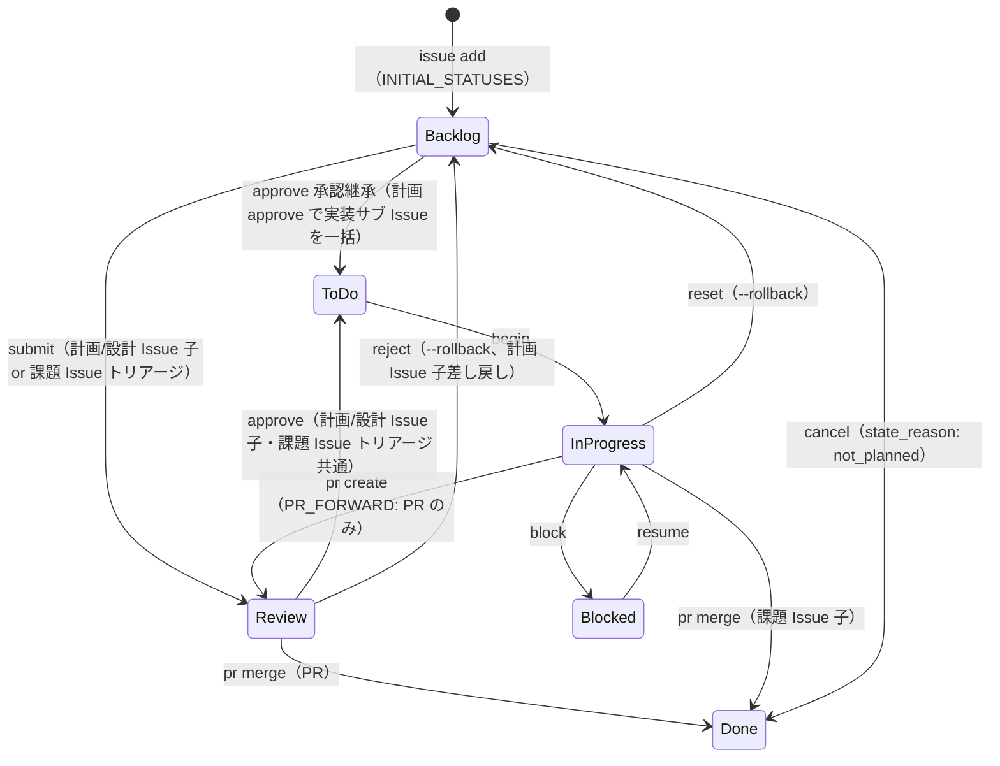

# GitHub 操作リファレンス

セッション/GitHub スキル共通リファレンス。CLI コマンド、ワークフロー、規約の単一情報源。

## 目次

- アーキテクチャ: Issues + Projects ハイブリッド
- 前提条件
- DraftIssue vs Issue
- shirokuma-flow CLI リファレンス
- `--from-file` vs `--body-file` 使い分け
- ステータスワークフロー
- ラベル規約
- よくあるエラー対処

## アーキテクチャ: Issues + Projects ハイブリッド

| コンポーネント | 用途 |
|-------------|------|
| **Issues** | タスク管理、`#123` 参照、履歴 |
| **Projects** | Status/Priority/Size フィールド管理 |
| **Labels** | 影響範囲の補助分類（`area:<領域>` 形式、語彙はプロジェクト定義） |
| **Discussions** | ADR、Knowledge、Research、Q&A |

**ステータスは Projects フィールドで管理**（ラベルではない）。

Project 命名規約: Project 名 = リポジトリ名（例: `blogcms` リポ → `blogcms` プロジェクト）。

## 前提条件

- `gh` CLI インストール・認証済み
- GitHub Project 設定済み（未設定なら `/setting-up-project` を実行）
- Discussions 有効化（カテゴリ: ADR, Knowledge, Research）（任意）

## DraftIssue vs Issue

| 機能 | DraftIssue | Issue |
|------|-----------|-------|
| `#number` | なし | あり（`#123`） |
| 外部参照 | 不可 | 可 |
| コメント | 不可 | 可 |
| ユースケース | 軽量メモ | 完全なタスク |

**推奨**: `#number` サポートのため `issue add` をデフォルトで使用。

## shirokuma-flow CLI リファレンス

直接の `gh` コマンドより shirokuma-flow CLI を優先。設定は `.shirokuma/config.yaml`。

### Issues（主要インターフェース）

```bash
shirokuma-flow issue list                            # オープン Issue 一覧
shirokuma-flow issue list --all                      # クローズ含む
shirokuma-flow issue list --status "In progress"     # ステータスフィルタ
shirokuma-flow issue context {number}                # 詳細取得・キャッシュ（→ .shirokuma/github/{org}/{repo}/issues/{number}/body.md を Read ツールで読み込む）
shirokuma-flow issue add /tmp/shirokuma-flow/new-issue.md  # メタデータ+本文を一括入力
shirokuma-flow issue update {number} /tmp/shirokuma-flow/{number}-body.md  # 本文更新
shirokuma-flow issue update {number} --title "新しいタイトル"                      # タイトル更新
shirokuma-flow issue update {number} --labels "area:<領域>"               # ラベル更新
shirokuma-flow issue update {number} --assignees "@me"                             # 担当者更新
shirokuma-flow begin {number}                                                       # In progress 遷移 + assign @me（checkpoint、推奨）
shirokuma-flow submit {number} [--comment <file>]                                   # Review 遷移（checkpoint、推奨）
shirokuma-flow block {number} --reason "..."                                        # Blocked 遷移 + reason 記録（checkpoint、推奨）
shirokuma-flow resume {number} [--comment <file>]                                   # Blocked → In progress 復帰（checkpoint、推奨）
shirokuma-flow approve {number}                                                     # 課題 Issue: Review → ToDo（トリアージ承認）/ 計画・設計 Issue 子: Review → ToDo（syncParentStatus で親を子から導出。計画 approve は実装サブ Issue を Backlog → ToDo にカスケード）（checkpoint、推奨）
shirokuma-flow status transition {number} --to "In progress"                        # primitive ステータス遷移（checkpoint 未対応の ToDo 遷移等で使用）
shirokuma-flow issue comment {number} /tmp/shirokuma-flow/{number}-comment.md
shirokuma-flow issue comments {number}                   # コメント一覧
shirokuma-flow issue update {number} --comment {comment-id} /tmp/shirokuma-flow/{number}-comment-fix.md  # コメント編集
shirokuma-flow issue close {number}
shirokuma-flow issue cancel {number}
shirokuma-flow issue reopen {number}
```

### Pull Requests

```bash
shirokuma-flow pr create --from-file /tmp/shirokuma-flow/pr.md             # メタデータ+本文を一括入力
shirokuma-flow pr create --base main --head develop --title "release: v0.2.0"  # リリースワークフロー（メタデータのみ）
shirokuma-flow pr list                                      # PR 一覧（デフォルト: open）
shirokuma-flow pr list --state merged --limit 5            # フィルタリング
shirokuma-flow pr show {number}                             # PR 詳細（body, diff stats, linked issues）
shirokuma-flow pr comments {number}                         # レビューコメント・スレッド
shirokuma-flow pr merge {number} --squash                   # マージ + ステータス更新
shirokuma-flow pr reply {number} --reply-to {id} - <<'EOF'
返信内容
EOF
shirokuma-flow pr resolve {number} --thread-id {id}        # スレッド解決
```

### Projects（アイテム操作）

```bash
shirokuma-flow project update {number} --field-status "Done"  # フィールド更新（唯一の手段）
shirokuma-flow project add-issue {number}                     # Issue をプロジェクトに追加
shirokuma-flow project delete PVTI_xxx                        # アイテム削除
```

### Discussions

```bash
shirokuma-flow discussion list --category ADR --limit 5
shirokuma-flow discussion search "キーワード"         # Discussions 検索
shirokuma-flow issue search --type discussions "キーワード"  # issue search 経由でも可
shirokuma-flow issue context {number}   # 詳細取得・キャッシュ（→ .shirokuma/github/{org}/{repo}/issues/{number}/body.md を Read ツールで読み込む）
shirokuma-flow discussion add /tmp/shirokuma-flow/discussion.md  # メタデータ+本文を一括入力
```

### 横断検索

```bash
shirokuma-flow issue search "キーワード"                          # Issues / PR 検索（デフォルト）
shirokuma-flow issue search --type discussions "キーワード"       # Discussions のみ
shirokuma-flow issue search --type issues,discussions "キーワード" # Issues + Discussions 横断
```

### Repository

```bash
shirokuma-flow repo info
shirokuma-flow repo labels
```

### クロスリポジトリ操作

```bash
shirokuma-flow issue list --repo docs
shirokuma-flow issue add --repo docs /tmp/shirokuma-flow/new-issue.md
```

### gh フォールバック（CLI 未対応の操作のみ）

```bash
# ラベル管理
gh label list
gh label create "name" --color "0E8A16" --description "Desc"

# リポジトリ情報
gh repo view --json nameWithOwner -q '.nameWithOwner'

# 認証
gh auth login
gh auth status

```

## `--from-file` vs `--body-file` 使い分け

| パターン | 使用コマンド | 理由 |
|---------|-------------|------|
| `issue add` 推奨 | `issue add`, `discussion add` | メタデータ+本文を1ファイルに集約、フラグ組み合わせミス防止 |
| `issue comment` 推奨 | Issue/Discussion へのコメント追加 | キャッシュへの自動保存 + `comment_url` 返却 |
| `issue update` / `status transition` | Status/body/title/labels/assignees 更新 | キャッシュ編集不要の直接更新（`status transition` は primitive。通常は `begin`/`submit`/`block`/`resume`/`approve` を推奨） |
| `--body-file` 維持 | `pr reply`, `status update-batch` | 本文のみでメタデータ不要な操作 |

### `--from-file` フロントマター形式

```markdown
---
title: Issue タイトル
type: Feature
priority: Medium
size: M
labels: [area:<領域>]
---

本文をここに記述する。
```

フロントマターの安全フィールドはコマンド種別で異なる:

| コマンド | 安全フィールド |
|---------|--------------|
| `issue add` | `title`, `type`, `priority`, `size`, `labels`, `state`, `state_reason`, `parent` |
| `pr create` | `title`, `base`, `head` |
| `discussion add` | `title`, `category` |

CLI フラグが設定済みの場合はフラグを優先。`--from-file` と positional `[body-file]` は排他（同時指定でエラー）。

### 本文渡し Tier ガイド

`issue add` / `issue comment` / `pr create` / `pr edit` / `pr reply` は positional file 引数のみ受け付け（インライン文字列は構造的に拒否）。`issue close` / `issue cancel` / `pr close` / `discussions create` 等は引き続き `--body-file` を取る。Tier の選び方は同一思想:

| Tier | 対象 | パターン | 用途 |
|------|------|---------|------|
| Tier 1 (stdin) | 残存 `--body-file` コマンド | `--body-file - <<'EOF'...EOF` | クローズ理由（issue close / cancel、pr close）、短い説明 |
| Tier 1 (stdin) | positional コマンド | `pr reply 42 --reply-to N - <<'EOF'...EOF` | 短い返信 |
| Tier 2 (file) | 残存 `--body-file` コマンド | Write → `--body-file /tmp/shirokuma-flow/xxx.md` | Discussion 投稿、Project 本文 |
| Tier 2 (file) | positional コマンド | Write → `issue add /tmp/shirokuma-flow/xxx.md` 等 | Issue 本体、PR 本文、コメント |

heredoc delimiter は `<<'EOF'`（シングルクォートで変数展開防止）。Tier 2 で本文を反復更新する場合は Write/Edit パターン（初回 Write → 以降 Edit で差分更新）を適用する。詳細は `item-maintenance.md` の「ファイルベース本文編集」セクション参照。

## ステータスワークフロー

GitHub Projects V2 の Status は 6 値:



| ステータス | 説明 | 主な遷移コマンド |
|-----------|------|----------------|
| Backlog | 新規登録・未着手。Issue 作成時のデフォルト | `issue add` 時の初期値 |
| ToDo | 着手準備完了（計画承認後に syncParentStatus で自動遷移） | `approve` 後の親 Issue 自動同期（計画 Issue 子）/ `status transition --to ToDo`（手動） |
| In progress | 作業中（計画 / 設計 / 実装すべて） | `begin <N>` |
| Blocked | 中断中（理由を Issue コメントに記録） | `block <N> --reason "..."` |
| Review | 人間判断待ち（課題 Issue トリアージ承認待ち / 計画・設計レビュー / PR コードレビュー）。課題 Issue の Review はトリアージ承認待ち（`approve` で ToDo へ）または PR レビュー（PR は別エンティティ） | `submit <N>` |
| Done | 完了（キャンセルも `state_reason: not_planned` で Done に統一） | `approve <N>`（計画/設計 Issue 子） / `pr merge` / `issue cancel <N>` |

旧ステータス（`Approved` / `Completed` / `Pending` / `Ready` / `On Hold` / `Cancelled` 等）は廃止。LEGACY 値は `LEGACY_STATUS_VALUES` で透過読み取りされる。

## ラベル規約

作業種別の分類は **Issue Types**（Organization レベルの Type フィールド）が主な手段。ラベルは作業の**影響範囲**を示す補助的な仕組み:

| 仕組み | 役割 | 例 |
|--------|------|-----|
| Issue Types | 作業の**種類** | Feature, Bug, Chore, Docs, Research, Evolution |
| エリアラベル | 作業の**影響範囲** | `area:<領域>`（プロジェクト定義） |
| 運用ラベル | トリアージ・ライフサイクル | `duplicate`, `invalid`, `wontfix` |

ラベルはプロジェクト構造に合わせて手動追加。ステータスは Projects フィールドで管理。

## よくあるエラー対処

| エラー | 対処 |
|-------|------|
| `shirokuma-flow: command not found` | インストール: `npm i -g @shirokuma-library/flow` |
| `gh: command not found` | インストール: `brew install gh` or `sudo apt install gh` |
| `not logged in` / `not authenticated` | 実行: `gh auth login` |
| No project found | `/setting-up-project` を実行してプロジェクト作成 |
| Discussions disabled/category not found | ローカルファイルにフォールバック |
| `HTTP 404` | リポジトリ名と権限を確認 |
| API rate limit | キャッシュ済み/部分データを表示 |
